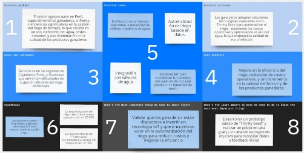

# **CAPÍTULO I: INTRODUCCIÓN**
## 1.1. Startup Profile
### 1.1.1. Descripción de la Startup
En IoTeam, somos un grupo apasionado de ingenieros que ha unido fuerzas para transformar el sector agrícola con soluciones tecnológicas de vanguardia. Creemos en el poder de la innovación para enfrentar los desafíos más críticos de la agricultura moderna, y es por eso que hemos desarrollado "Thirsty Seed": una aplicación de última generación que combina la inteligencia del Internet de las Cosas (IoT) con la necesidad vital de un riego eficiente y controlado.

"Thirsty Seed" (o "semilla sedienta" en español) no es solo una herramienta más; es la clave para que los agricultores puedan maximizar el rendimiento de sus forrajes, garantizar la calidad del alimento para sus animales, y reducir costos operativos de manera significativa. Con nuestra aplicación, el riego se convierte en un proceso automatizado, eliminando la incertidumbre y asegurando que cada gota de agua se utilice de manera óptima. Además, los usuarios reciben notificaciones en tiempo real cuando es necesario rellenar sus depósitos, manteniendo el flujo de trabajo sin interrupciones.

Al elegir IoTeam, los agricultores acceden a una tecnología que no solo les brinda un control sin precedentes sobre sus cultivos, sino que también les permite concentrarse en lo que realmente importa: el crecimiento y la sostenibilidad de sus operaciones. Con "Thirsty Seed", estamos redefiniendo la manera en que el sector agrícola aborda el riego, llevando la eficiencia, la precisión y la tranquilidad directamente a las manos de nuestros usuarios.

MISIÓN

En **IoTeam**, nuestra misión es empoderar a los agricultores y Productores Agricolas con tecnologías avanzadas de IoT a través de nuestra aplicación **'Thirsty Seed'**, ofreciendo soluciones que no solo mejoren la eficiencia y productividad del riego de forrajes, sino que también contribuyan al bienestar del medio ambiente y la sostenibilidad agrícola

VISIÓN
Convertirnos en el líder en soluciones de riego inteligente para el sector agrícola, ayudando a los agricultores de todo el mundo a optimizar el uso del agua, mejorar la calidad de sus cultivos, y garantizar la sostenibilidad de sus operaciones
### 1.1.2. Perfiles de integrantes del equipo
|Foto|Nombre completo|Código de estudiante|Descripción de carrera|Resumen de conocimientos técnicos y habilidades|
| - | - | - | - | - |
| |Manuel Alexis Vargas Quispe|u202113256|Ingeniería de Software|Tengo experiencia en C++, HTML, CSS, Angular, y Vue.js. He trabajado con Android Studio para el desarrollo de aplicaciones móviles y tengo conocimientos básicos de backend. También he usado Cisco Packet Tracer, y tengo conocimientos en Python y Java a nivel básico.|
||Rafael Arturo Luyo||Ingeniería de Software |Mi nombre es Rafael, tengo 22 años. Me considero una persona agradable, puntual y respetuosa. Elegí mi profesión actual porque disfruto haciendo varios ejercicios o problemas relacionados con el uso de la programación, además de interesarme mucho la malla curricular. Me motiva aprender cosas nuevas y también la futura estabilidad económica.|
||Kurt Matthews Puican Salas|u202016643|Ingeniería de Software|A lo largo de mi carrera he adquirido diversos conocimientos en varios ámbitos como en diversos lenguajes como C++, C#, Java, HTML y MySQL. Considero que tengo los conocimientos necesarios para poder aportar a este trabajo.|
||Shayla Lussiné Choque Puma|U20201C144|Ingeniería de Software|Soy una persona participativa y responsable en el trabajo en equipo, con experiencia en desarrollo de software utilizando C# y .NET, Java con SpringBoot, y tecnologías frontend como Angular y Vue.js. Además, tengo habilidades en desarrollo móvil con Flutter, lo que me permite contribuir eficazmente a proyectos diversos.|
||Giakomo Rodolfo Causso Mariano|u202118374|Ingeniería de Software|En el progreso que obtuve respecto a mis conocimientos académicos, pude aprender lenguajes como Java, JavaScript, C++, C#, SQL, HTML y CSS. Dentro del desarrollo de la carrera de Ingeniería de software pude tener un mayor concepto referente a proyectos y gracias a eso he sido capaz de desarrollar habilidades como el liderazgo, compañerismo, compromiso, responsabilidad y creatividad.|

## 1.2. Solution Profile
### 1.2.1 Antecedentes y problemática
**Who:**

El sector agrícola en Perú enfrenta desafíos crecientes en la calidad de riego para mejorar la calidad de sus forrajes, un componente esencial para asegurar la calidad de sus productos. 

Los proveedores de agua y sistemas de riego también son actores clave, ya que suministran los recursos y tecnologías necesarias para que los Productores Agrícolas optimicen sus operaciones.

**What:**

La principal problemática es la falta de eficiencia y control en el riego de forrajes. El riego tradicional, que a menudo se realiza de manera manual o con sistemas rudimentarios, resulta en un uso ineficiente del agua, lo que no sólo encarece los costos operativos, sino que también pone en riesgo la sostenibilidad del negocio. Esto impacta negativamente en la producción de forrajes de alta calidad, afectando la alimentación del ganado y, en consecuencia, la calidad de la carne y los productos lácteos.

**Where:**

Esta problemática es especialmente crítica en las regiones ganaderas de Perú, como Cajamarca, Puno, y Huancayo, donde la ganadería es una actividad económica fundamental. En estas áreas, el acceso al agua y la gestión eficiente del riego son determinantes para la viabilidad de las explotaciones ganaderas.

**When:**

El problema ha sido persistente, pero se ha intensificado en los últimos años debido a factores como el cambio climático, que ha alterado los patrones de lluvia y ha hecho que el agua sea un recurso aún más escaso y valioso. La necesidad de soluciones innovadoras y eficientes ha aumentado en respuesta a estos desafíos emergentes.

**Why:**

La falta de tecnologías avanzadas para la automatización y optimización del riego es una de las principales causas del problema. Los sistemas de riego actuales a menudo no cuentan con la capacidad de monitorear y ajustar automáticamente la cantidad de agua utilizada, lo que lleva a un desperdicio significativo de recursos. Además, la falta de información en tiempo real impide a los Productores Agrícolas tomar decisiones informadas sobre el riego, aumentando los costos y reduciendo la eficiencia.

**How:**

La problemática afecta a los Productores Agrícolas al incrementar sus costos operativos y reducir la calidad de sus productos, lo que a su vez afecta la rentabilidad de sus negocios. Sin un riego adecuado, los forrajes pueden sufrir de sequía o sobre irrigación, lo que impacta negativamente en su calidad nutricional. Los proveedores de agua y sistemas de riego también enfrentan desafíos para ofrecer soluciones que realmente respondan a las necesidades de sus clientes en el sector Productores Agrícolas.

**How Much:**

El impacto económico de la problemática es significativo. Los Productores Agrícolas pueden ver incrementados sus costos de producción en un 20-30% debido a la ineficiencia en el uso del agua. Además, la calidad inferior del forraje puede llevar a una disminución en la producción de carne y leche, afectando los ingresos en un 10-15%. Por otro lado, los proveedores de sistemas de riego podrían estar perdiendo una oportunidad de mercado importante al no ofrecer soluciones tecnológicas avanzadas que se alineen con las necesidades actuales de los Productores Agrícolas.

### 1.2.2 Lean UX Process
#### 1.2.2.1. Lean UX Problem Statements
Los productores agrícolas enfrentan dificultades significativas para gestionar el riego de forrajes en épocas de escasez de agua o sequía. Esta falta de control y planificación precisa resulta en una disminución de la calidad de los forrajes y genera pérdidas económicas considerables debido a la necesidad de renovaciones frecuentes.
#### 1.2.2.2. Lean UX Assumptions
**Business Assumption**

Implementaremos un sistema de monetización que incluye planes de suscripción básica y premium, así como costos asociados con los artefactos y su instalación. Con estos planes, los usuarios podrán acceder a todas las funcionalidades de la aplicación, incluyendo el control avanzado del riego de forrajes y otros beneficios destacados.

**Business Outcome Assumption**

Esperamos que la implementación de la aplicación web y móvil de 'Thirsty Seed' incremente la retención de clientes en un 20% durante el primer año y genere ingresos adicionales al captar al menos un 15% del mercado de Productores Agrícolas de la región en los primeros dos años. Además, aspiramos a que los planes de suscripción básica y premium representen el 75% de los ingresos recurrentes, asegurando una base financiera sólida para la expansión futura.

**User Assumption**

Nuestros usuarios objetivo en este caso Productores Agrícolas y proveedores de riego buscan soluciones tecnológicas que les permitan optimizar el uso del agua y el tiempo dedicado al riego de forrajes. Creemos que estarán dispuestos a adoptar una solución que les ofrezca monitoreo en tiempo real y control automatizado del riego, siempre que sea fácil de usar e integrar con sus sistemas actuales.

**User Outcome Assumption**

Creemos que, al utilizar la función de monitoreo de humedad en tiempo real de "Thirsty Seed", los usuarios experimentarán una mejora en la precisión del riego, lo que permitirá una reducción del desperdicio de agua y una disminución de los costos operativos en un 20% durante el primer año. Además, se espera que la optimización en la cantidad de agua aplicada contribuya a un crecimiento más robusto de los cultivos, incrementando la calidad del forraje producido en un 10%.

Creemos que, al recibir notificaciones automáticas para iniciar el riego, los usuarios lograrán una programación de riego más consistente y eficiente, reduciendo los errores humanos y liberando tiempo al usuario. Esto debería facilitar una reducción en los costos operativos asociados al riego en un 15% durante el primer año. Además, la gestión más eficiente del riego se traducirá en una mejora en la calidad del forraje en un 12%.

Creemos que, al utilizar los reportes detallados sobre el estado de cada parcela, los usuarios podrán tomar decisiones más informadas y precisas sobre el riego, resultando en una mejora en la eficiencia operativa y una reducción de costos en un 18% durante el primer año. Además, la capacidad de ajustar la estrategia de riego basada en información consolidada debería aumentar la calidad del forraje en un 14%.

Creemos que, al elegir entre modalidades de riego parcial y completa, los usuarios experimentarán una mayor flexibilidad en la gestión del riego, lo que llevará a una reducción de los costos operativos en un 22% durante el primer año. La modalidad de automatización completa liberará tiempo a los usuarios, permitiéndoles enfocarse en otras áreas de su operación, mientras que la modalidad parcial proporcionará un control más fino, mejorando la calidad del forraje en un 13%.

Creemos que, al analizar los reportes mensuales sobre las actividades de irrigación, los usuarios podrán evaluar el rendimiento del sistema y realizar ajustes que optimicen el uso del agua, reduciendo los costos operativos en un 20% durante el primer año. Además, la información detallada facilitará una planificación más efectiva para la siguiente temporada, incrementando la calidad del forraje en un 11%.

**Feature Assumption**

La aplicación "Thirsty Seed" incluye un sistema de monitoreo de humedad en tiempo real para los cultivos. Utiliza sensores IoT para recopilar datos sobre los niveles de humedad del suelo y proporciona esta información a los usuarios a través de la aplicación.

La aplicación envía notificaciones automáticas cuando es necesario comenzar el proceso de riego, basado en los datos del monitoreo de humedad y otros parámetros ambientales.

La aplicación ofrece un reporte detallado sobre el estado actual de cada parcela, incluyendo información sobre humedad, condiciones del suelo y necesidades de riego.

La aplicación permite a los usuarios seleccionar entre modalidades de riego parcial y completo. La modalidad parcial ofrece un control más manual, mientras que la modalidad completa automatiza todo el proceso de riego.

La aplicación genera un reporte mensual sobre las actividades de irrigación, incluyendo detalles como la cantidad de agua utilizada, tiempos de riego y eficiencia.
#### 1.2.2.3. Lean UX Hypothesis Statements
**Business Hypothesis**

Creemos que implementar un sistema de monetización con planes de suscripción básica y premium, además de costos asociados con los artefactos y su instalación
Para Productores Agrícolas y proveedores de riego
Logrará una generación sostenida de ingresos que permitirá financiar el desarrollo continuo y la expansión del producto
Sabremos que esto es cierto cuando veamos un incremento en la adopción de los planes premium y una contribución del 75% de los ingresos recurrentes provenientes de las suscripciones en el primer año.

**Business Outcome Hypothesis**

Creemos que la implementación de la aplicación web y móvil de 'Thirsty Seed'
Para Productores Agrícolas que necesitan soluciones de riego eficientes y proveedores de riego que buscan integrar tecnologías avanzadas
Logrará un aumento en la retención de clientes y la captación de un 15% del mercado regional en los primeros dos años
Sabremos que esto es cierto cuando veamos un aumento del 20% en la retención de clientes y un crecimiento sostenido en la base de usuarios durante el primer año.

**User Hypothesis**

Creemos que nuestros usuarios objetivo, los productores agrícolas y proveedores de riego
Para buscar tecnologías que optimicen el uso del agua y el tiempo dedicado al riego de forrajes
Logrará una adopción significativa de 'Thirsty Seed' si el producto es fácil de usar y se integra con sus sistemas actuales
Sabremos que esto es cierto cuando veamos una alta tasa de adopción en el primer año y retroalimentación positiva relacionada con la facilidad de uso e integración.

**User Outcome Hypothesis**

Creemos que al implementar la función de monitoreo de humedad en tiempo real en "Thirsty Seed",

Para productores agrícolas que desean mejorar la precisión del riego,

Logrará una reducción del desperdicio de agua y una disminución de los costos operativos en un 20% durante el primer año,

**Sabremos que esto es cierto cuando veamos** que los usuarios reporten una reducción en el uso de agua y en los costos asociados al riego, así como una mejora en la calidad del forraje.

Creemos que al implementar notificaciones automáticas para iniciar el riego,

Para productores agrícolas que buscan una programación de riego más consistente y eficiente,

Logrará reducir los errores humanos y liberar tiempo para los usuarios, disminuyendo los costos operativos en un 15% durante el primer año,

Sabremos que esto es cierto cuando veamos que los usuarios reportan menos errores en la programación del riego y una mejora en la eficiencia, reflejada en la reducción de costos.

Creemos que al ofrecer reportes detallados sobre el estado de cada parcela,

Para productores agrícolas que desean tomar decisiones más informadas sobre el riego,

Logrará una mejora en la eficiencia operativa y una reducción de costos en un 18% durante el primer año,

Sabremos que esto es cierto cuando veamos que los usuarios ajustan su estrategia de riego con base en los reportes y experimentan una reducción de costos y una mejora en la calidad del forraje.

Creemos que al permitir la elección entre modalidades de riego parcial y completo,

Para productores agrícolas que necesitan flexibilidad en la gestión del riego,

Logrará una mayor flexibilidad, una reducción de los costos operativos en un 22% durante el primer año, y una mejora en la calidad del forraje en un 13%,

Sabremos que esto es cierto cuando veamos que los usuarios adoptan las modalidades de riego y reportan mejoras en eficiencia y calidad del forraje.

Creemos que al ofrecer reportes mensuales sobre las actividades de irrigación,

Para productores agrícolas que desean evaluar y optimizar el uso del agua,

Logrará una optimización en el uso del agua y una reducción de costos operativos en un 20% durante el primer año,

Sabremos que esto es cierto cuando veamos que los usuarios utilizan los reportes para ajustar su estrategia de riego, resultando en una mejora en la planificación y en la calidad del forraje.

**Feature Hypothesis**

Creemos que al incluir un sistema de monitoreo de humedad en tiempo real para los cultivos en "Thirsty Seed",

Para productores agrícolas que buscan una precisión mejorada en la gestión del riego,

Logrará proporcionarles datos precisos y en tiempo real sobre los niveles de humedad del suelo,

Sabremos que esto es cierto cuando veamos que los usuarios utilizan regularmente la función de monitoreo y reportan una mejora en la eficiencia del uso del agua.

Creemos que al enviar notificaciones automáticas cuando sea necesario comenzar el proceso de riego,

Para productores agrícolas que buscan automatizar y optimizar el tiempo de riego,

Logrará que los usuarios inicien el riego de manera más eficiente, reduciendo el desperdicio de agua y los errores humanos,

Sabremos que esto es cierto cuando veamos que los usuarios responden rápidamente a las notificaciones y reportan una reducción en los errores de riego.

Creemos que al ofrecer reportes detallados sobre el estado actual de cada parcela,

Para productores agrícolas que necesitan información completa y precisa para tomar decisiones de riego,

Logrará que los usuarios tomen decisiones más informadas y ajusten sus estrategias de riego en consecuencia,

Sabremos que esto es cierto cuando veamos que los usuarios consultan los reportes regularmente y reportan mejoras en la gestión del riego.

Creemos que al permitir que los usuarios seleccionen entre modalidades de riego parcial y completo,

Para productores agrícolas que desean flexibilidad en la gestión del riego,

Logrará que los usuarios ajusten el nivel de automatización según sus necesidades específicas, mejorando la eficiencia y reduciendo costos,

Sabremos que esto es cierto cuando veamos que los usuarios utilizan ambas modalidades y reportan una mejora en la eficiencia operativa.

Creemos que al generar un reporte mensual sobre las actividades de irrigación,

Para productores agrícolas que desean evaluar el rendimiento del riego y planificar mejoras,

Logrará que los usuarios optimicen el uso del agua y ajusten sus estrategias de riego basándose en datos históricos,

Sabremos que esto es cierto cuando veamos que los usuarios revisan los reportes mensuales y reportan una mejora en la planificación y la eficiencia del riego.

#### 1.2.2.4. Lean UX Canvas

Link del Lean UX Canvas: <https://miro.com/welcomeonboard/QTdaaFFZemNJVjN0SmdJTnM2QjZDS2VRUzc1QTc0dmo2d3dXblhKQlN0QUNBUVQyUTBEZFdPejEwY01wdklPSnwzMDc0NDU3MzQ4Mjg5MTQwMTczfDI=?share_link_id=470334668716> 

## 1.3. Segmentos objetivo
A continuación se describirán los sectores objetivos de nuestro negocio

**Segmento Productores Agrícolas:**

Este segmento está compuesto por Productores Agricolas en Perú que dependen del riego de forrajes para alimentar a su ganado, esencial para la producción de carne y leche. "Thirsty Seed" es especialmente relevante para este grupo, ya que les permite optimizar el uso del agua y mejorar la calidad de los forrajes, lo que se traduce en una mayor eficiencia y rentabilidad.

**Características Demográficas**:

- **Ubicación Geográfica**: Principalmente en regiones ganaderas clave como la sierra y la selva, incluyendo departamentos como Cajamarca, Puno, y Huancayo, donde la ganadería es una actividad económica vital.
- **Tamaño de la Empresa**: Desde pequeñas explotaciones familiares hasta grandes operaciones ganaderas comerciales.
- **Edad y Experiencia**: Adultos de mediana edad con experiencia en ganadería, aunque también se incluye a jóvenes emprendedores interesados en modernizar sus métodos.

**Información Estadística**:

- En Perú, la ganadería representa aproximadamente el 30% del PIB agrícola, con una producción anual de carne de cerca de 500,000 toneladas y de leche de alrededor de 2 millones de toneladas.
- El uso del agua en la agricultura representa más del 80% del consumo total del país, y dentro de este sector, el riego de forrajes es una de las actividades más intensivas en el uso de agua.
- La implementación de tecnologías de riego eficientes, como las automatizadas por IoT, puede reducir el consumo de agua en la ganadería hasta en un 25%, lo que se traduce en ahorros significativos y una mejora en la calidad del forraje.

**Segmento Proveedores de servicio de agua:**

Este segmento incluye a los proveedores que suministran agua y sistemas de riego a los Productores Agricolas en Perú. Estos proveedores son cruciales en la cadena de valor agrícola y tienen la oportunidad de mejorar sus servicios mediante la adopción de tecnologías avanzadas como **"Thirsty Seed"**.

**Características Demográficas**:

- **Ubicación Geográfica**: Concentrados en regiones agrícolas y ganaderas como la costa, la sierra y partes de la selva, donde la agricultura de riego es esencial.
- **Tamaño de la Empresa**: Desde pequeños distribuidores locales hasta grandes empresas nacionales de sistemas de riego.
- **Tipo de Negocio**: Proveedores de equipos de riego por aspersión y goteo, distribuidores de agua para riego agrícola, y empresas de instalación y mantenimiento de sistemas de riego.
- **Relación con la Tecnología**: Empresas interesadas en adoptar tecnologías IoT para mejorar la eficiencia y sostenibilidad de sus operaciones y productos.

**Información Estadística**:

- El mercado de sistemas de riego en Perú ha experimentado un crecimiento anual del 5% en los últimos años, alcanzando un valor estimado de $150 millones en 2023.
- Según datos del Ministerio de Agricultura y Riego (MINAGRI), aproximadamente el 15% de las tierras agrícolas en Perú utilizan sistemas de riego tecnificado, y se espera que esta cifra crezca debido a la demanda de soluciones más eficientes y sostenibles.
- Un estudio del sector en 2023 reveló que un 40% de los proveedores en Perú están buscando integrar tecnologías IoT en sus sistemas de riego para reducir el consumo de agua y mejorar la eficiencia operativa.