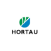
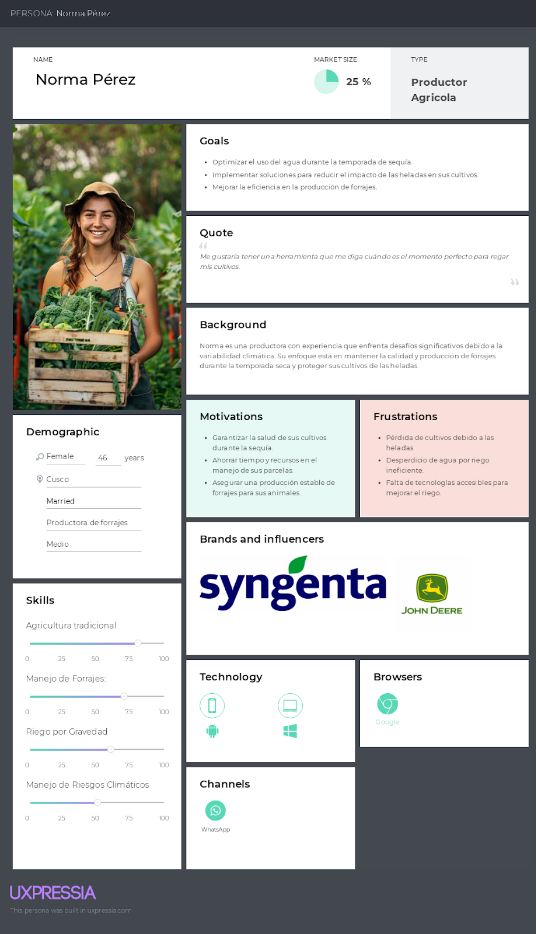

# **CAPÍTULO II: REQUIREMENTS ELICITATION & ANALYSIS**
## 2.1. Competidores
En este apartado veremos los principales competidores que tenemos en comparación a Thirsty seed
### 2.1.1. Análisis competitivo
<table><tr><th colspan="6" valign="top"><b>Competitive Analysis Landscape</b></th></tr>
<tr><td rowspan="2" valign="top">
¿Por qué llevar a 

cabo este análisis?
</td><td colspan="5" valign="top">
Escriba en el recuadro la pregunta que busca responder o el objetivo de 

este análisis.
</td></tr>
<tr><td colspan="5" valign="top">¿Cómo se posiciona "Thirsty Seed" en comparación con los líderes del mercado en soluciones de riego inteligente y tecnologías IoT aplicadas a la agricultura?</td></tr>
<tr><td colspan="2" valign="top"></td>
  <td valign="top"></td>
  <td valign="top"></td>
  <td valign="top"></td>
  <td valign="top"></td></tr>
<tr><td rowspan="2" valign="top">Perfil</td><td valign="top">Overview </td><td valign="top">Thirsty Seed es una solución innovadora desarrollada por IoTeam, enfocada en la optimización del riego para productores agricolas. A través de la tecnología IoT, la aplicación permite el monitoreo en tiempo real de la humedad del suelo y el control automatizado del riego. Esto ayuda a los productores agrícolas a mejorar la eficiencia del uso del agua, reducir costos operativos, y aumentar la calidad de sus forrajes. </td><td valign="top">Netafim es líder global en tecnologías de riego por goteo y microirrigación, ofreciendo soluciones que incluyen sistemas automatizados y tecnologías de IoT para mejorar la eficiencia hídrica y la productividad agrícola. Con presencia en más de 110 países, Netafim es conocida por su innovación continua y su enfoque en la sostenibilidad agrícola.</td><td valign="top">Valley Irrigation, una división de Valmont Industries, se especializa en sistemas de riego por pivote central y tecnologías de riego inteligente. Sus soluciones están diseñadas para grandes explotaciones agrícolas y se destacan por integrar tecnologías IoT que permiten el monitoreo y control remoto del riego.</td><td valign="top">Hortau es una empresa innovadora en el ámbito del riego inteligente, centrada en la agricultura de precisión. Utilizan sensores de humedad del suelo y tecnologías IoT para ofrecer a los agricultores datos en tiempo real y control automático del riego, ayudando a optimizar el uso del agua y mejorar la salud de los cultivos.</td></tr>
<tr><td valign="top">Ventaja competitiva ¿Qué valor ofrece a los clientes? </td><td valign="top">Thirsty Seed ofrece a los agricultores un control preciso y automatizado del riego, maximizando el uso eficiente del agua y reduciendo significativamente el desperdicio. La integración de sensores IoT proporciona datos en tiempo real sobre las condiciones del suelo, lo que permite tomar decisiones informadas y mejorar la productividad de los forrajes. Además, la accesibilidad y facilidad de uso del sistema lo hacen ideal para pequeños agricultores que buscan modernizar sus prácticas sin grandes inversiones iniciales​</td><td valign="top">Netafim ofrece a los clientes una combinación de tecnología avanzada, conocimiento profundo del mercado agrícola, y soluciones personalizadas que maximizan la eficiencia del uso del agua. Su experiencia y capacidad para proporcionar soluciones completas desde el diseño hasta la implementación, respaldadas por una fuerte red de soporte, son grandes diferenciadores.</td><td valign="top">Valley Irrigation ofrece soluciones robustas y fiables que combinan ingeniería avanzada con tecnologías de control de precisión, permitiendo a los agricultores optimizar el uso del agua en grandes áreas de cultivo. Su plataforma Valley 365 proporciona una gestión centralizada y eficiente de las operaciones agrícolas, lo que es un valor clave para clientes que operan a gran escala.</td><td valign="top">
Hortau se destaca por su enfoque en el monitoreo en tiempo real de la humedad del suelo y la capacidad de ajustar automáticamente los sistemas de riego en función de las necesidades específicas del cultivo. Esto proporciona a los agricultores una forma más eficiente y sostenible de gestionar el riego, reduciendo el desperdicio de agua y mejorando la producción agrícola.

</td></tr>
<tr><td rowspan="2" valign="top">Perfil de Marketing</td><td valign="top">Mercado objetivo </td><td valign="top">El mercado objetivo de Thirsty Seed son productores agrícolas que cultivan forrajes para la ganadería en áreas rurales de Perú. También se enfoca en proveedores de sistemas de riego que buscan mejorar la eficiencia hídrica en sus operaciones. La solución es especialmente valiosa para agricultores en regiones donde la escasez de agua y la variabilidad climática son desafíos críticos​</td><td valign="top">Netafim se dirige principalmente a grandes explotaciones agrícolas, corporaciones agrícolas, y gobiernos que buscan implementar soluciones sostenibles de riego a gran escala. Su mercado objetivo incluye a agricultores que cultivan productos de alto valor como frutas, vegetales, y viñedos, así como aquellos que necesitan sistemas de riego eficientes en regiones con escasez de agua.</td><td valign="top">Valley Irrigation se enfoca en agricultores de grandes explotaciones agrícolas, especialmente en zonas rurales de Estados Unidos, América Latina, y otros mercados emergentes donde el riego por pivote es común. Su objetivo principal son los productores de cultivos como maíz, trigo, soja, y algodón, que requieren soluciones eficientes de riego para cubrir grandes extensiones de tierra.</td><td valign="top">Hortau se dirige a agricultores y productores que buscan implementar la agricultura de precisión, especialmente aquellos interesados en el riego sostenible y la optimización del uso del agua. Su mercado objetivo incluye cultivos de frutas, vegetales, viñedos, y otros productos que requieren un monitoreo cuidadoso del suelo y la humedad.</td></tr>
<tr><td valign="top">Estrategias de marketing</td><td valign="top">Thirsty Seed emplea una estrategia de diferenciación centrada en la educación y el soporte a los agricultores. Utiliza talleres de capacitación y demostraciones de campo para mostrar los beneficios de la tecnología IoT en el riego. Además, la empresa busca alianzas con organizaciones locales para implementar proyectos piloto que demuestren el impacto positivo de la solución. Se promueven planes de suscripción asequibles, destacando la accesibilidad y el ahorro a largo plazo para los usuarios​</td><td valign="top">
<b>Educación y Capacitación:</b> Netafim invierte en programas de capacitación y educación para agricultores y distribuidores, mostrando los beneficios de sus tecnologías y cómo estas pueden mejorar la eficiencia y productividad.

<b>Innovación y Liderazgo de Pensamiento:</b> La empresa utiliza estudios de casos y demostraciones en campo para mostrar cómo sus soluciones han ayudado a transformar explotaciones agrícolas en todo el mundo.

<b>Sostenibilidad como Valor Clave:</b> Netafim posiciona sus productos como esenciales para la sostenibilidad agrícola, utilizando campañas que enfatizan la conservación del agua y la responsabilidad ambiental.

<b>Colaboraciones Estratégicas:</b> Colabora con organizaciones internacionales y gobiernos para implementar proyectos de riego a gran escala, lo que también sirve como una potente herramienta de marketing.

</td><td valign="top">
<b>Enfoque en la Escalabilidad</b>: Valley Irrigation destaca cómo sus sistemas pueden cubrir grandes áreas de cultivo con alta eficiencia, utilizando campañas que muestran su capacidad para reducir costos y mejorar rendimientos.

<b>Tecnología y Conectividad</b>: Promueven sus sistemas de riego inteligentes, como <i>Valley 365</i>, a través de contenido digital y demostraciones que resaltan la facilidad de uso y el control remoto.

<b>Red de Distribución Global</b>: Valley utiliza su extensa red de distribuidores y socios para aumentar la penetración en mercados clave, proporcionando soporte local y adaptando sus soluciones a las necesidades regionales.

<b>Participación en Ferias y Exposiciones</b>: La empresa participa activamente en ferias agrícolas y eventos del sector, donde exhiben sus tecnologías y conectan directamente con clientes potenciales.

</td><td valign="top">
<b>Marketing Educativo</b>: Hortau utiliza webinars, blogs, y guías educativas para enseñar a los agricultores sobre la importancia del riego basado en datos y cómo sus productos pueden reducir el uso de agua y aumentar la salud del suelo.

<b>Diferenciación por Innovación</b>: Enfatizan la innovación tecnológica y el uso de sensores avanzados para diferenciarse de competidores tradicionales, destacando los beneficios de la agricultura de precisión.

<b>Demostraciones en Campo</b>: Hortau organiza demostraciones en campo para mostrar en tiempo real cómo sus sistemas optimizan el riego, proporcionando datos instantáneos que ayudan a tomar decisiones más informadas.

<b>Testimonios y Casos de Éxito</b>: Utilizan testimonios y estudios de caso de clientes satisfechos para fortalecer la credibilidad y atraer a nuevos clientes interesados en soluciones comprobadas.

</td></tr>
<tr><td rowspan="3" valign="top">Perfil de Producto</td><td valign="top">Productos & Servicios</td><td valign="top">
<b>Productos:</b> Sensores de humedad del suelo conectados a IoT, aplicación móvil para monitoreo y automatización del riego.

<b>Servicios:</b> Notificaciones en tiempo real, integración con sistemas de riego existentes, asesoría personalizada para la optimización del uso del agua.
</td><td valign="top">
<b>Productos:</b> Sistemas de riego por goteo, microirrigación, automatización del riego, soluciones IoT.

<b>Servicios:</b> Consultoría en diseño de sistemas de riego, soporte técnico, capacitación y educación para agricultores.
</td><td valign="top">
<b>Productos</b>: Sistemas de riego por pivote central, tecnología de riego inteligente (Valley 365), sensores de humedad del suelo.

<b>Servicios</b>: Instalación de sistemas, monitoreo y control remoto, soporte técnico a través de distribuidores.

</td><td valign="top">
<b>Productos</b>: Sensores de humedad del suelo, sistemas de riego automatizados basados en IoT.

<b>Servicios</b>: Monitorización en tiempo real, informes de rendimiento, asesoría en agricultura de precisión.
</td></tr>
<tr><td valign="top">Precios & Costos </td><td valign="top">
<b>Precios</b>: Asequibles para pequeños y medianos agricultores, con opciones de escalabilidad.

<b>Costos</b>: Bajos a moderados, con un enfoque en accesibilidad y retorno de inversión a través de la optimización del uso del agua.

</td><td valign="top">
<b>Precios</b>: Varían según el tamaño del proyecto y las soluciones personalizadas.

<b>Costos</b>: Costos relativamente altos debido a la personalización y la tecnología avanzada.

</td><td valign="top">
<b>Precios</b>: Generalmente altos, dirigidos a grandes explotaciones agrícolas.

<b>Costos</b>: Costos de instalación y mantenimiento elevados, justificados por la durabilidad y eficiencia a gran escala.

</td><td valign="top">
<b>Precios</b>: Competitivos, con enfoque en productores medianos y grandes.

<b>Costos</b>: Moderados, centrados en la implementación de tecnologías de precisión que prometen ahorros en el largo plazo.

</td></tr>
<tr><td valign="top">Canales de distribución (Web y/o Móvil) </td><td valign="top">
<b>Web</b>: Plataforma para información sobre productos, soporte técnico, y compra online.

<b>Móvil</b>: Aplicación móvil para monitoreo, automatización del riego y notificaciones en tiempo real.

</td><td valign="top">
<b>Web</b>: Plataforma online para información y venta de productos, soporte técnico.

<b>Móvil</b>: Aplicaciones móviles para la gestión y monitoreo de sistemas de riego.

</td><td valign="top">
<b>Web</b>: Portal para clientes que ofrece acceso a Valley 365 y soporte técnico.

<b>Móvil</b>: Aplicación Valley 365 para monitoreo remoto y gestión de sistemas de riego.

</td><td valign="top">
<b>Web</b>: Sitio web con recursos educativos, informes en tiempo real y compra de productos.

<b>Móvil</b>: Aplicación móvil para la monitorización y control de sistemas de riego en tiempo real.

</td></tr>
<tr><td rowspan="5" valign="top">Análisis SWOT </td><td colspan="5" valign="top">Realice esto para su startup y sus competidores. Sus fortalezas deberían apoyar sus oportunidades y contribuir a lo que ustedes definen como su posible ventaja competitiva.  </td></tr>
<tr><td valign="top">Fortalezas</td><td valign="top"><b>Enfoque en la Agricultura de Pequeña y Mediana Escala</b>: Proporciona soluciones accesibles y escalables que se adaptan bien a los agricultores con menos recursos.</td><td valign="top"><b>Tecnología IoT Fácil de Usar</b>: Ofrece una aplicación intuitiva y sensores de bajo costo que simplifican la gestión del riego.</td><td valign="top"><b>Innovación y Flexibilidad</b>: Capacidad de adaptación rápida a las necesidades del mercado local, específicamente en Perú.</td><td valign="top"></td></tr>
<tr><td valign="top">Debilidades </td><td valign="top"><b>Falta de Reconocimiento de Marca</b>: Como una nueva startup, enfrenta desafíos para ganar confianza y reconocimiento en un mercado dominado por grandes jugadores.</td><td valign="top"><b>Recursos Financieros Limitados</b>: A diferencia de los competidores, cuenta con un presupuesto más reducido para investigación, desarrollo y marketing.</td><td valign="top"></td><td valign="top"></td></tr>
<tr><td valign="top">Oportunidades </td><td valign="top"><b>Creciente Demanda de Soluciones Sostenibles</b>: El aumento de la conciencia sobre la sostenibilidad abre oportunidades para soluciones de riego que ahorren agua.</td><td valign="top"><b>Mercados Emergentes en América Latina</b>: Regiones como Perú tienen una alta necesidad de tecnología agrícola avanzada y accesible.</td><td valign="top"><b>Alianzas Estratégicas</b>: Colaboración con organizaciones locales y gobiernos para implementar pilotos y proyectos a gran escala.</td><td valign="top"></td></tr>
<tr><td valign="top">Amenazas</td><td valign="top"><b>Competencia de Grandes Empresas</b>: Compañías establecidas con más recursos pueden ofrecer productos similares y podrían competir en precio.</td><td valign="top"><b>Barrera de Adopción de Tecnología</b>: La resistencia de los agricultores tradicionales a adoptar nuevas tecnologías puede ralentizar la adopción del producto.</td><td valign="top"><b>Regulación y Políticas Locales</b>: Cambios en las políticas agrícolas y regulaciones locales pueden afectar la implementación de soluciones tecnológicas.</td><td valign="top"></td></tr>
</table>

### 2.1.2. Estrategias y tácticas frente a competidores
Como parte del equipo de Thirsty Seed, hemos desarrollado una serie de estrategias y tácticas para enfrentar a nuestros competidores y posicionar nuestra solución como líder en el mercado tomando en cuenta nuestros principales competidores:

- Diferenciación por precio: Ofreceremos planes de suscripción y soluciones más asequibles, diseñadas específicamente para pequeños y medianos agricultores. Nuestro objetivo es destacar la accesibilidad de Thirsty Seed frente a productos más costosos de competidores como Netafim, asegurando que nuestra tecnología esté al alcance de todos.
- Enfoque en la personalización: Desarrollaremos soluciones modulares y personalizables que se adapten a las necesidades específicas de cada agricultor. Esto nos permitirá ofrecer una flexibilidad superior a la de nuestros competidores, que suelen ofrecer soluciones más estandarizadas.
- Soluciones Offline: Implementaremos características que permitan el monitoreo y control del riego en áreas con conectividad limitada. De esta manera, superaremos la dependencia de conectividad avanzada que tienen competidores como CropX, garantizando que Thirsty Seed sea funcional en cualquier entorno.
- Sencillez y facilidad de uso: Nos enfocaremos en destacar la facilidad de uso de Thirsty Seed en contraste con soluciones más complejas. Queremos atraer a aquellos usuarios que buscan una tecnología intuitiva y fácil de implementar, minimizando las barreras de adopción.
- Sostenibilidad como valor agregado: Pondremos un fuerte énfasis en las características sostenibles y amigables con el medio ambiente de Thirsty Seed. Este enfoque nos permitirá diferenciarnos de competidores que no priorizan la sostenibilidad, atrayendo a un segmento creciente de usuarios conscientes del medio ambiente.
- Innovación tecnológica: Continuaremos integrando y mejorando la tecnología IoT en Thirsty Seed, ofreciendo soluciones avanzadas y preparadas para el futuro. Nos aseguraremos de superar a nuestros competidores manteniéndonos a la vanguardia tecnológica.

## 2.2. Entrevistas
### 2.2.1. Diseño de entrevistas

Segmento Productores Agrícolas

1. ¿Cuáles son los principales problemas al cuidar de sus forrajes?
1. Durante la época de escasez de lluvia, ¿con qué frecuencia realiza el riego de sus forrajes?
1. ¿Cómo afecta la variabilidad del clima a sus prácticas de riego y manejo de forrajes?
1. ¿Qué medidas ha tomado para contrarrestar los impactos de escasez de lluvia en sus forrajes? ¿Cuán efectivas han sido estas medidas?
1. ¿Qué tan importante considera la automatización del riego para mejorar la eficiencia y la calidad del forraje en su producción?
1. ¿Qué herramientas o tecnologías utiliza actualmente para monitorear y gestionar el riego? ¿O no utiliza alguna?
1. ¿Ha experimentado pérdidas significativas de forraje debido a una mala gestión del riego? Si es así, ¿cómo las ha manejado?
1. ¿Cómo evalúa el costo de riego en relación con el rendimiento de sus forrajes?
1. ¿Qué tan dispuesto estaría a adoptar una solución tecnológica que optimice el riego, incluso si implica un costo inicial adicional?
1. ¿Cuáles son sus expectativas en cuanto al retorno de inversión si decidiera implementar un sistema de riego automatizado?
1. ¿Qué tipo de forrajes produce?

Segmento Proveedores

1. ¿Qué tipo de sistemas de riego ofrecen actualmente a sus clientes Productores Agrícolas?
1. ¿Han recibido solicitudes de sus clientes para mejorar o modernizar los sistemas de riego?
1. ¿Cuáles son los principales desafíos que enfrentan al suministrar agua de riego a los Productores Agrícolas?
1. ¿Qué tecnologías o innovaciones considera que serían más efectivas para mejorar la eficiencia del riego en las explotaciones ganaderas?
1. ¿Qué criterios utilizan para recomendar un sistema de riego a sus clientes?
1. ¿Cómo ha evolucionado la demanda de tecnologías avanzadas en sistemas de riego entre sus clientes en los últimos años?
1. ¿Qué retroalimentación reciben de sus clientes sobre la eficiencia y efectividad de los sistemas de riego que ofrecen?
1. ¿Cómo gestionan las fluctuaciones en la disponibilidad de agua para riego en sus operaciones?
1. ¿Están explorando o implementando tecnologías de IoT en sus soluciones de riego? Si es así, ¿cómo han respondido sus clientes?
1. ¿Qué mejoras o innovaciones creen que podrían ofrecer para diferenciarse de la competencia en el mercado de sistemas de riego?
### 2.2.2. Registro de entrevistas
Nombres y Apellidos: Isabel Valle

Edad: 65

Distrito: Arequipa

Captura: 

URL:<https://youtu.be/0wucwk8gFIA>  

Resumen:
Isabel, de 65 años, es proveedor de agua para sistemas de riego y enfrenta desafíos durante la temporada de sequía debido a la alta demanda y la escasez de recursos. Ofrece sistemas de riego por gravedad, aspersión y goteo, pero ha notado un creciente interés de los productores en modernizar sus métodos para mejorar la eficiencia del agua. Luis menciona la necesidad de una mejor infraestructura y de adoptar tecnologías como IoT y sensores de humedad, aunque la adopción es baja debido al desconocimiento. Sus clientes reclaman por la eficiencia de los sistemas y por la falta de suministro constante. Luis recomienda riego por goteo y está interesado en soluciones que optimicen el uso del agua y mejoren el riego en las comunidades agrícolas.
### 2.2.3. Análisis de entrevistas
**Productores Agrícolas**

Los productores agrícolas en el distrito de Acopia enfrentan desafíos significativos relacionados con la sequía y las heladas. Durante la temporada seca, que va de junio a octubre, todos los productores entrevistados (100%) reportan una frecuencia de riego limitada a 1-2 veces al mes debido a la escasez de agua, lo cual afecta gravemente la salud de sus cultivos. Este riego infrecuente, combinado con el impacto destructivo de las heladas, destaca la necesidad urgente de soluciones que mitiguen estos problemas. El 100% de los entrevistados utilizan riego por gravedad o inundación, con solo una pequeña fracción empleando riego por aspersión, lo que lleva a grandes pérdidas de agua por tiempos excesivos de riego. Ambos productores muestran un fuerte interés en herramientas tecnológicas para monitorear la humedad del suelo y automatizar el riego, con una disposición a pagar un costo adicional por estas soluciones. Además, la cebada es mencionada como la variedad más resistente a las heladas, lo que subraya su importancia en las estrategias de cultivo bajo condiciones adversas.

**Proveedores de agua de riego**

Los proveedores de riego, como Ernesto, enfrentan problemas críticos relacionados con la alta demanda de agua durante la sequía. El 100% de los proveedores entrevistados identifican la escasez de agua como un problema central, y observan que el riego inadecuado y el desperdicio de agua son desafíos significativos. El desperdicio ocurre tanto por una gestión ineficiente del riego como por el transporte inadecuado del agua. Los proveedores están interesados en soluciones tecnológicas que optimicen la gestión del agua y reduzcan el desperdicio. La recomendación de Ernesto de adoptar riego por aspersión refleja una preferencia por métodos más eficientes para manejar el agua, aunque actualmente no se emplean tecnologías modernas para este propósito. El consenso en el interés por mejorar la eficiencia del riego mediante la tecnología sugiere una oportunidad clara para introducir soluciones que puedan abordar estos problemas y mejorar la prestación del servicio en la comunidad.

## 2.3. Needfinding
### 2.3.1. User Personas
Segmento Productores Agricolas:

Segmento Proveedores de agua:

### 2.3.2. User Task Matrix

<table><tr><th rowspan="2" valign="top">Task</th><th colspan="2" valign="top">Productores Agrícolas</th><th colspan="2" valign="top">Proveedores de Agua de Riego</th></tr>
<tr><td valign="top">Frecuencia	</td><td valign="top">Importancia	</td><td valign="top">Frecuencia	</td><td valign="top">Importancia</td></tr>
<tr><td valign="top">Monitorear las condiciones climáticas</td><td valign="top">Alta</td><td valign="top">Alta</td><td valign="top">Alta</td><td valign="top">Alta</td></tr>
<tr><td valign="top">Planificar el calendario de riego	</td><td valign="top">Alta</td><td valign="top">Alta</td><td valign="top">Alta</td><td valign="top">Alta</td></tr>
<tr><td valign="top">Organizar recursos para el riego	</td><td valign="top">Media</td><td valign="top">Alta</td><td valign="top">Alta</td><td valign="top">Alta</td></tr>
<tr><td valign="top">Supervisar el riego	</td><td valign="top">Alta</td><td valign="top">Alta</td><td valign="top">Alta</td><td valign="top">Alta</td></tr>
<tr><td valign="top">Ajustar métodos de riego según condiciones	</td><td valign="top">Media</td><td valign="top">Alta</td><td valign="top">Alta</td><td valign="top">Alta</td></tr>
<tr><td valign="top">Gestionar el uso eficiente del agua	</td><td valign="top">Media</td><td valign="top">Alta</td><td valign="top">Alta</td><td valign="top">Alta</td></tr>
<tr><td valign="top">Implementar medidas contra las heladas	</td><td valign="top">Baja</td><td valign="top">Alta</td><td valign="top">Baja</td><td valign="top">Media</td></tr>
<tr><td valign="top">Reparar y mantener el equipo de riego</td><td valign="top">Media</td><td valign="top">Media</td><td valign="top">Alta</td><td valign="top">Alta</td></tr>
<tr><td valign="top">Revisar el rendimiento de los cultivos	</td><td valign="top">Alta</td><td valign="top">Alta</td><td valign="top">Media</td><td valign="top">Media</td></tr>
<tr><td valign="top">Ajustar la estrategia de riego según resultados	</td><td valign="top">Media</td><td valign="top">Alta</td><td valign="top">Media</td><td valign="top">Alta</td></tr>
</table>

Análisis del User Task Matrix

Tareas de Mayor Frecuencia e Importancia:

Tanto los Productores Agrícolas como los Proveedores de Agua de Riego realizan con alta frecuencia e importancia las tareas de Monitorear las condiciones climáticas, Planificar el calendario de riego, Supervisar el riego, y Gestionar el uso eficiente del agua. Estas tareas son fundamentales para asegurar que el riego se realice de manera efectiva y eficiente, considerando las condiciones climáticas y la disponibilidad de agua.

Diferencias Principales:

Los Proveedores de Agua de Riego asignan mayor importancia y frecuencia a la tarea de reparar y mantener el equipo de riego debido a su responsabilidad en garantizar que los sistemas de riego comunitarios estén operativos y en buen estado.

Los productores agrícolas, por otro lado, tienden a realizar con más frecuencia la tarea de revisar el rendimiento de los cultivos, dado que su enfoque está en maximizar la productividad agrícola en sus parcelas individuales.

Coincidencias Relevantes:

Ambos segmentos coinciden en la alta importancia de ajustar métodos de riego según condiciones y ajustar la estrategia de riego según resultados. Aunque la frecuencia de estas tareas puede variar, su relevancia es clara, ya que ambas son necesarias para adaptar las prácticas de riego a las condiciones actuales y optimizar el uso del agua.

Oportunidades de Intervención:

Dado que tanto los Productores Agrícolas como los Proveedores de Agua de Riego enfrentan desafíos similares en cuanto al monitoreo del clima y la planificación del riego, existen claras oportunidades para introducir herramientas tecnológicas que faciliten estas tareas, mejorando la eficiencia y efectividad de las operaciones diarias.

### 2.3.3. User Journey Mapping
### 2.3.4. Empathy Mapping
### 2.3.5. As-is Scenario Mapping
## 2.4. Ubiquitous Language
