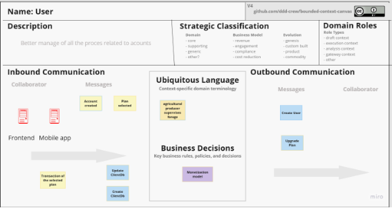
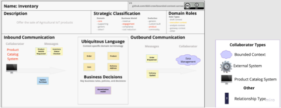
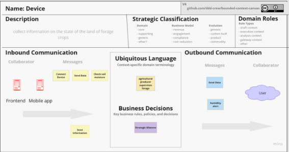
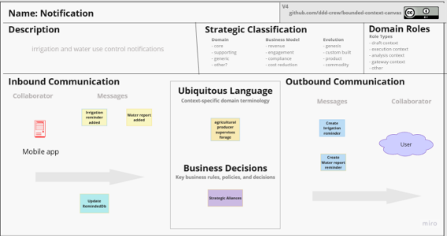
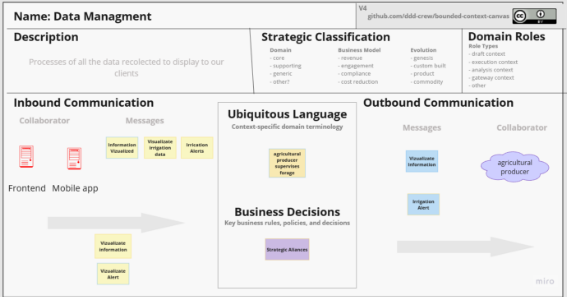

# **CAPÍTULO IV: SOLUTION SOFTWARE DESIGN**
## 4.1. Strategic-Level Domain-Driven Design
### 4.1.1. EventStorming
#### 4.1.1.1 Candidate Context Discovery
#### 4.1.1.2 Domain Message Flows Modeling
#### 4.1.1.3 Bounded Context Canvases

User:

Inventory:

Device:

Notifications:

Data Management:

### 4.1.2. Context Mapping
### 4.1.3. Software Architecture
#### 4.1.3.2. Software Architecture Context Level Diagrams
#### 4.1.3.2. Software Architecture Container Level Diagrams
#### 4.1.3.3. Software Architecture Deployment Diagrams
## 4.2. Tactical-Level Domain-Driven Design
### 4.2.1. Bounded Context: <Bounded Context Name>
#### 4.2.1.1. Domain Layer
#### 4.2.1.2. Interface Layer
#### 4.2.1.3. Application Layer
#### 4.2.1.4. Infrastructure Layer
#### 4.2.1.6. Bounded Context Software Architecture Component Level Diagrams
#### 4.2.1.7. Bounded Context Software Architecture Code Level Diagrams
##### 4.2.1.7.1. Bounded Context Domain Layer Class Diagrams
##### 4.2.1.7.2. Bounded Context Database Design Diagram
