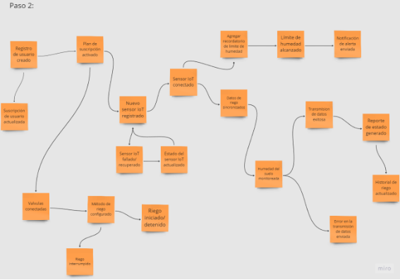
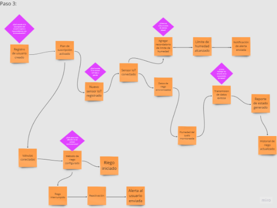
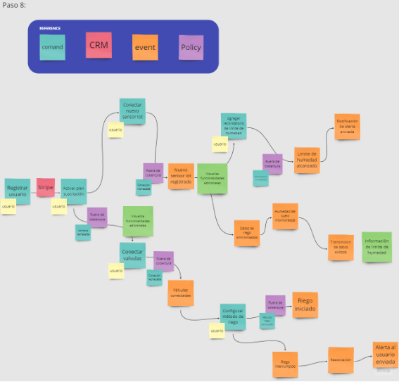
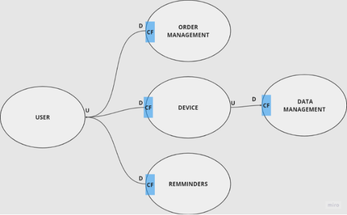

# **CAPÍTULO IV: SOLUTION SOFTWARE DESIGN**
## 4.1. Strategic-Level Domain-Driven Design
### 4.1.1. EventStorming

#### 4.1.1.1 Candidate Context Discovery
#### 4.1.1.2 Domain Message Flows Modeling
#### 4.1.1.3 Bounded Context Canvases

User:

Inventory:

Device:

Notifications:

Data Management:

### 4.1.2. Context Mapping

### 4.1.3. Software Architecture
#### 4.1.3.2. Software Architecture Context Level Diagrams
#### 4.1.3.2. Software Architecture Container Level Diagrams
#### 4.1.3.3. Software Architecture Deployment Diagrams
## 4.2. Tactical-Level Domain-Driven Design

### 4.2.1 Bounded Context: Inventory

<table><tr><th colspan="2" valign="top">Nombre</th><th colspan="2" valign="top">Inventory </th><th valign="top"></th></tr>
<tr><td colspan="2" valign="top">Descripción</td><td colspan="2" valign="top">Representa la compra de productos</td><td valign="top"></td></tr>
<tr><td colspan="2" valign="top">Atributos</td><td colspan="2" valign="top">Relaciones</td><td rowspan="1" valign="top">Métodos   </td></tr>
<tr><td valign="top">Nombre </td><td valign="top">Tipo de Dato</td><td valign="top">Tipo</td><td valign="top">Clases/Enums</td></tr>
<tr><td valign="top">devicePurchaseId   </td><td valign="top">DevicePurchaseId</td><td valign="top">Composición</td><td valign="top">DevicePurchaseId   </td><td valign="top">purchase()  </td></tr>
<tr><td valign="top">userId   </td><td valign="top">
	   

UserId   

</td><td valign="top">Composición</td><td valign="top">UserId</td><td valign="top">cancelPurchase ()  </td></tr>
<tr><td valign="top">title   </td><td valign="top">string   </td><td valign="top">Composición</td><td valign="top">Catalog   </td><td valign="top">track()   </td></tr>
<tr><td valign="top">description  </td><td valign="top">string</td><td valign="top">Composición</td><td valign="top">History </td><td valign="top"></td></tr>
<tr><td valign="top">date   </td><td valign="top">date</td><td valign="top"></td><td valign="top"></td><td valign="top"></td></tr>
<tr><td valign="top">catalog   </td><td valign="top">catalog</td><td valign="top"></td><td valign="top"></td><td valign="top"></td></tr>
<tr><td valign="top">history   </td><td valign="top">history</td><td valign="top"></td><td valign="top"></td><td valign="top"></td></tr>
</table>

|Nombre|Catalog|||
| :- | :- | :- | :- |
|Descripción|Representar el catálogo de productos|||
|Atributos|Relaciones|||
|` `Nombre|Tipo de Dato|||
|product|Product|Composición|Product|

|Nombre|Product|
| :- | :- |
|Descripción|Representar un producto|
|Atributos||
|Nombre|Tipo de Dato|
|description|String|

|Nombre|History|
| :- | :- |
|Descripción|Representar el historial de compras|
|Valores||
|LessThanTwoPurchase   ||
|MoreThanTwoPurchase   ||

|Nombre|UserId|
| :- | :- |
|Descripción|Representa el identificador del usuario  |
|Atributos||
|Nombre|Tipo de Dato|
|userId   |long   |

|Nombre|DevicePurchaseId |
| :- | :- |
|Descripción|Representar el identificador   de la compra |
|Atributos||
|Nombre|Tipo de Dato|
|devicePurchaseId   |long   |

#### 4.2.1.1. Domain Layer
Se identificó que la única clase central en el negocio es la clase **Device Purchase**, la cual representa la compra de productos como sensores o válvulas. Según las reglas de negocio, el productor agrícola tiene la posibilidad de solicitar una o más sensores o válvulas, según sea necesario para su situación particular.

**Entities**:

- **DevicePurchase (Aggregate)**: Representa la compra de una válvula o sensor.

**ValueObjects**:

- **UserId (Aggregate)**: Representa el identificador único del usuario.
- **DevicePurchaseId (Aggregate)**: Representa el identificador único de la compra.
- **Product**: Representa un sensor o una válvula.
- **Catalog (Aggregate)**: Representa el catálogo disponible.

**Enums**:

- **History (Aggregate)**: Representa el historial de compras.

**Factories**:

- **DevicePurchaseFactory**: Facilita la creación de órdenes de compra.

**Interfaces**:

- **IDevicePurchaseRepository:** Interfaz para la clase **DevicePurchaseRepository**, que ayuda a mantener un bajo nivel de acoplamiento.

|Nombre   |IDevicePurchaseRepository   |
| :- | :- |
|Descripción   |Permite la conexión con la base de datos  |
|Métodos||
|findAll()   ||
|findById()||
|findByUserId()||
|create()   ||
|update()  ||
|delete()   ||

- IDevicePurchaseServices: Interfaz de la clase DevicePurchaseService, ayuda a mantener un bajo acoplamiento

|Nombre   |IDevicePurchaseService|
| :- | :- |
|Descripción   |Declara las funciones que contiene las reglas de   negocio|
|Métodos||
|getAll()   ||
|getById() ||
|getByUserId() ||
|create()   ||
|delete()   ||
|purchase()   ||
|cancelPurchase ()   ||
|track()   ||

#### 4.2.1.2. Interface Layer
**Controllers** 

|**Class Name** |**Purpose** |**Methods** |
| :- | :- | :- |
|DataController |Maneja las solicitudes relacionadas con datos y reportes. |getDataRecords(request: DataRequest): Response, generateReport(request: ReportRequest): Response |

**Consumers** 

|**Class Name** |**Purpose** |**Methods** |
| :- | :- | :- |
|DataEventConsumer |Escucha y procesa eventos relacionados con datos. |consumeDataEvent(event: DataEvent): void |

![Shape]** 
#### 4.2.1.3. Application Layer
**Command Handlers** 

|**Class Name** |**Purpose** |**Methods** |
| :- | :- | :- |
|GenerateReportHandler |Maneja el comando para generar un reporte de análisis de datos. |handle(command: GenerateReportCommand): void |
|SaveDataRecordHandler |Maneja el comando para guardar un nuevo registro de datos. |handle(command: SaveDataRecordCommand): void |

**Event Handlers** 

|**Class Name** |**Purpose** |**Methods** |
| :- | :- | :- |
|DataRecordSavedEventHandler |Maneja eventos relacionados con la creación de registros de datos. |handle(event: DataRecordSavedEvent): void |

![Shape]** 

#### 4.2.1.4. Infrastructure Layer
**Repositories Implementations** 

|**Class Name** |**Purpose** |**Methods** |
| :- | :- | :- |
|DataRecordRepositoryImpl |Implementación concreta de DataRecordRepository para acceder a datos persistidos. |findByDateRange(dateRange: DateRange): List<DataRecord>, save(record: DataRecord): void, delete(recordId: String): void |
|AnalysisReportRepositoryImpl |Implementación concreta de AnalysisReportRepository para acceder a reportes persistidos. |findById(reportId: String): AnalysisReport, save(report: AnalysisReport): void |

**Messaging Systems** 

|**Class Name** |**Purpose** |**Methods** |
| :- | :- | :- |
|DataEventPublisher |Publica eventos relacionados con datos y reportes. |publish(event: DataEvent): void |

**External Services** 

|**Class Name** |**Purpose** |**Methods** |
| :- | :- | :- |
|ExternalAnalysisService |Servicio para interactuar con APIs externas para análisis avanzado. |performExternalAnalysis(data: List<DataRecord>): AnalysisReport, getExternalData(deviceId: String): List<DataRecord> |
**

**4.2.5. Bounded Context: Notification Management** 

**4.2.5.1. Domain Layer** 

**Entities** 

|**Class Name** |**Purpose** |**Attributes** |**Methods** |
| :- | :- | :- | :- |
|Notification |Representa una notificación que se envía a los usuarios. |notificationId: String, userId: String, message: String, status: String, timestamp: DateTime |markAsSent(): void, updateStatus(status: String): void |

**Value Objects** 

|**Class Name** |**Purpose** |**Attributes** |**Methods** |
| :- | :- | :- | :- |
|NotificationMessage |Define el contenido y formato de una notificación. |content: String, format: String |toString(): String |

**Aggregates** 

|**Class Name** |**Purpose** |**Root Entity** |**Methods** |
| :- | :- | :- | :- |
|NotificationAggregate |Agrega Notification y NotificationMessage para operaciones coherentes. |Notification |createNotification(userId: String, message: NotificationMessage): Notification, getNotification(notificationId: String): Notification |

**Domain Services** 

|**Class Name** |**Purpose** |**Methods** |
| :- | :- | :- |
|NotificationService |Proporciona lógica de negocio para la gestión y envío de notificaciones. |sendNotification(notification: Notification): void, getPendingNotifications(): List<Notification> |

**Repositories** 

|**Class Name** |**Purpose** |**Methods** |
| :- | :- | :- |
|NotificationRepository |Interfaz para acceder a notificaciones persistidas. |findById(notificationId: String): Notification, save(notification: Notification): void, delete(notificationId: String): void |

![Shape]** 

**4.2.5.2. Interface Layer** 

**Controllers** 

|**Class Name** |**Purpose** |**Methods** |
| :- | :- | :- |
|NotificationController |Maneja las solicitudes relacionadas con la creación y gestión de notificaciones. |createNotification(request: NotificationRequest): Response, getNotification(request: NotificationRequest): Response |

**Consumers** 

|**Class Name** |**Purpose** |**Methods** |
| :- | :- | :- |
|NotificationEventConsumer |Escucha y procesa eventos relacionados con el envío de notificaciones. |consumeNotificationEvent(event: NotificationEvent): void |
**

**4.2.5.3. Application Layer** 

**Command Handlers** 

|**Class Name** |**Purpose** |**Methods** |
| :- | :- | :- |
|CreateNotificationCommandHandler |Maneja el comando para crear una nueva notificación. |handle(command: CreateNotificationCommand): void |
|UpdateNotificationStatusHandler |Maneja el comando para actualizar el estado de una notificación. |handle(command: UpdateNotificationStatusCommand): void |

**Event Handlers** 

|**Class Name** |**Purpose** |**Methods** |
| :- | :- | :- |
|NotificationCreatedEventHandler |Maneja eventos relacionados con la creación de notificaciones. |handle(event: NotificationCreatedEvent): void |
**

**4.2.5.4. Infrastructure Layer** 

**Repositories Implementations** 

|**Class Name** |**Purpose** |**Methods** |
| :- | :- | :- |
|NotificationRepositoryImpl |Implementación concreta de NotificationRepository para acceder a notificaciones persistidas. |findById(notificationId: String): Notification, save(notification: Notification): void, delete(notificationId: String): void |

**Messaging Systems** 

|**Class Name** |**Purpose** |**Methods** |
| :- | :- | :- |
|NotificationEventPublisher |Publica eventos relacionados con la creación y envío de notificaciones. |publish(event: NotificationEvent): void |

**External Services** 

|**Class Name** |**Purpose** |**Methods** |
| :- | :- | :- |
|ExternalNotificationService |Servicio para interactuar con APIs externas para el envío de notificaciones. |sendNotificationToExternalService(notification: Notification): void, retrieveNotificationStatus(notificationId: String): String |
**

#### 4.2.1.6. Bounded Context Software Architecture Component Level Diagrams
#### 4.2.1.7. Bounded Context Software Architecture Code Level Diagrams
##### 4.2.1.7.1. Bounded Context Domain Layer Class Diagrams
##### 4.2.1.7.2. Bounded Context Database Design Diagram
